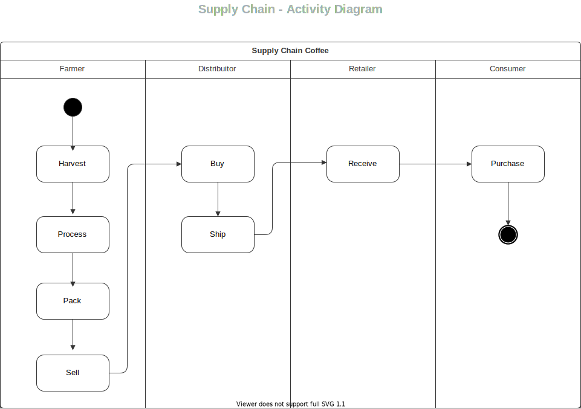
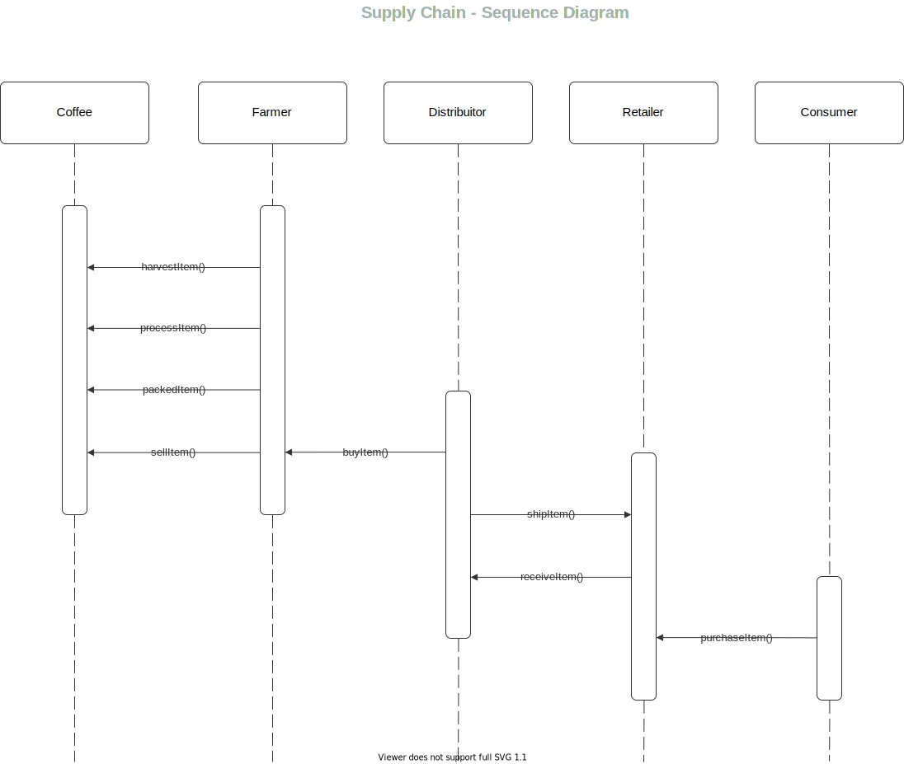
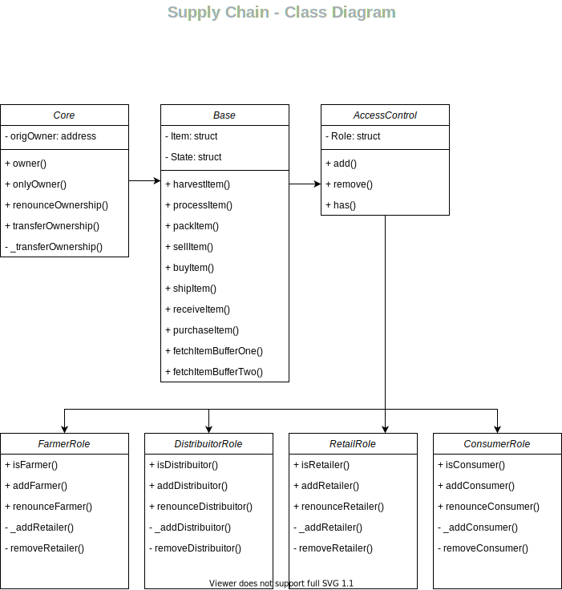

# Project Udacity - Supply Chain Coffee

## Truffle Version
>
    Truffle v5.4.6
>

## Solidity Version
>
    Solidity 0.8.0
>

## Node Version
>
    node v14.17.0
>

## web3 Version
>
    web3@1.6.1
>

## Contract Address
>
    0xad7defe4268ad35ae850dc05854efa9b75f5dec46051a12a25db4b51419a2e8f 
>

## Requirement 1: Project write-up - UML

## Activity Diagram



## Sequence Diagram



## State Diagram


## Class Diagram



## Requirement 2: Project write-up - Libraries

@truffle/hdwallet-provider to manage connection with test network rinkby using Infura

## Requirement 3: Project write-up - IPFS

I did not use IPFS to deliver my website for this project.

## Getting Started

These instructions will get you a copy of the project up and running on your local machine for development and testing purposes. See deployment for notes on how to deploy the project on a live system.

### Prerequisites

Please make sure you've already installed ganache-cli, Truffle and enabled MetaMask extension in your browser.

### Installing

A step by step series of examples that tell you have to get a development env running

Clone this repository:

```
git clone https://github.com/sanxzkid/udacity-supply-chain/tree/main/project
```

Change directory to ```project``` folder and install all requisite npm packages (as listed in ```package.json```):

```
cd project
npm install
```

Launch Ganache:

```
ganache-cli -m "spirit supply whale amount human item harsh scare congress discover talent hamster"
```

In a separate terminal window, Compile smart contracts:

```
truffle compile
```

This will create the smart contract artifacts in folder ```build\contracts```.

```
Compiling your contracts...
===========================
> Compiling .\contracts\Migrations.sol
> Compiling .\contracts\coffeeaccesscontrol\ConsumerRole.sol
> Compiling .\contracts\coffeeaccesscontrol\DistributorRole.sol
> Compiling .\contracts\coffeeaccesscontrol\FarmerRole.sol
> Compiling .\contracts\coffeeaccesscontrol\RetailerRole.sol
> Compiling .\contracts\coffeeaccesscontrol\Roles.sol
> Compiling .\contracts\coffeebase\SupplyChain.sol
> Compiling .\contracts\coffeecore\Ownable.sol
> Artifacts written to C:\Users\fsanx\dev\blockchain\projects\udacity-supply-chain\project\build\contracts
> Compiled successfully using:
   - solc: 0.8.0+commit.c7dfd78e.Emscripten.clang
```

Migrate smart contracts to the locally running blockchain, ganache-cli:

```
truffle migrate
```

```
Starting migrations...
======================
> Network name:    'development'
> Network id:      1639962120220
> Block gas limit: 6721975 (0x6691b7)


1_initial_migration.js
======================

   Replacing 'Migrations'
   ----------------------
   > transaction hash:    0x560c7d5eb777d7214d9d25815e3a7e5833951ef78eb9812973e05668bd59bf71
   > Blocks: 0            Seconds: 0
   > contract address:    0xD5B4fc545dcD14831A6cF5c1C55cAd1f89e51A1f
   > block number:        9
   > block timestamp:     1639962313
   > account:             0x27D8D15CbC94527cAdf5eC14B69519aE23288B95
   > balance:             99.91438102
   > gas used:            270388 (0x42034)
   > gas price:           20 gwei
   > value sent:          0 ETH
   > total cost:          0.00540776 ETH


   > Saving migration to chain.
   > Saving artifacts
   -------------------------------------
   > Total cost:          0.00540776 ETH


2_deploy_contracts.js
=====================

   Replacing 'FarmerRole'
   ----------------------
   > transaction hash:    0x58b1772b84662e032eee0ebb80ab6f5f9895aa43b2524a22780d3a7029f4790a
   > Blocks: 0            Seconds: 0
   > contract address:    0x4E89f8aa1791173F5a8FfB21e390eaC6bB7427cc
   > block number:        11
   > block timestamp:     1639962314
   > account:             0x27D8D15CbC94527cAdf5eC14B69519aE23288B95
   > balance:             99.90695486
   > gas used:            328770 (0x50442)
   > gas price:           20 gwei
   > value sent:          0 ETH
   > total cost:          0.0065754 ETH


   Replacing 'DistributorRole'
   ---------------------------
   > transaction hash:    0x42986ce84a3f943fb18f0c3b446a5bded6037f1114a9f7060b7566a2b50d21b4
   > Blocks: 0            Seconds: 0
   > contract address:    0x788D4959f9f29ef088c6F98162165778C765Fee6
   > block number:        12
   > block timestamp:     1639962314
   > account:             0x27D8D15CbC94527cAdf5eC14B69519aE23288B95
   > balance:             99.90111688
   > gas used:            291899 (0x4743b)
   > gas price:           20 gwei
   > value sent:          0 ETH
   > total cost:          0.00583798 ETH


   Replacing 'RetailerRole'
   ------------------------
   > transaction hash:    0xc8fd4d4ed24cb5d38e594bafe3cd3ed8095794bd101c2b749053da13bb497e15
   > Blocks: 0            Seconds: 0
   > contract address:    0x2A76f1C82b3EDD4b33a9259FdEE38dFdD1fcb3B4
   > block number:        13
   > block timestamp:     1639962315
   > account:             0x27D8D15CbC94527cAdf5eC14B69519aE23288B95
   > balance:             99.89527914
   > gas used:            291887 (0x4742f)
   > gas price:           20 gwei
   > value sent:          0 ETH
   > total cost:          0.00583774 ETH


   Replacing 'ConsumerRole'
   ------------------------
   > transaction hash:    0x33409d9896919a62d91102f64ceb734440202050ac3db98e16fc19a482b4ce1b
   > Blocks: 0            Seconds: 0
   > contract address:    0x143Fe7950139Bcd1345721AD8f589b9aCA08bCdD
   > block number:        14
   > block timestamp:     1639962315
   > account:             0x27D8D15CbC94527cAdf5eC14B69519aE23288B95
   > balance:             99.88944116
   > gas used:            291899 (0x4743b)
   > gas price:           20 gwei
   > value sent:          0 ETH
   > total cost:          0.00583798 ETH


   Replacing 'SupplyChain'
   -----------------------
   > transaction hash:    0x30e22b24cfb46fb2a8a12b719d813dd27f5239a2298e6626709c7240195bf16e
   > Blocks: 0            Seconds: 0
   > contract address:    0xC11814653157e6E8f2B2dcEDE099e517a24740E2
   > block number:        15
   > block timestamp:     1639962316
   > account:             0x27D8D15CbC94527cAdf5eC14B69519aE23288B95
   > balance:             99.84012832
   > gas used:            2465642 (0x259f6a)
   > gas price:           20 gwei


   > Saving artifacts


Summary
=======
> Total deployments:   6
> Final cost:          0.0788097 ETH

```

Test smart contracts:

```
truffle test
```

```
  Contract: SupplyChain
    √ Testing smart contract function harvestItem() that allows a farmer to harvest coffee (768ms)
    √ Testing smart contract function processItem() that allows a farmer to process coffee (369ms)
    √ Testing smart contract function packItem() that allows a farmer to pack coffee (486ms)
    √ Testing smart contract function sellItem() that allows a farmer to sell coffee (492ms)
    √ Testing smart contract function buyItem() that allows a distributor to buy coffee (577ms)
    √ Testing smart contract function shipItem() that allows a distributor to ship coffee (615ms)
    √ Testing smart contract function receiveItem() that allows a retailer to mark coffee received (783ms)
    √ Testing smart contract function purchaseItem() that allows a consumer to purchase coffee (689ms)
    √ Testing smart contract function fetchItemBufferOne() that allows anyone to fetch item details from blockchain (159ms)
    √ Testing smart contract function fetchItemBufferTwo() that allows anyone to fetch item details from blockchain (166ms)
```

All 10 tests should pass.

In a separate terminal window, launch the DApp:

```
npm run dev
```
